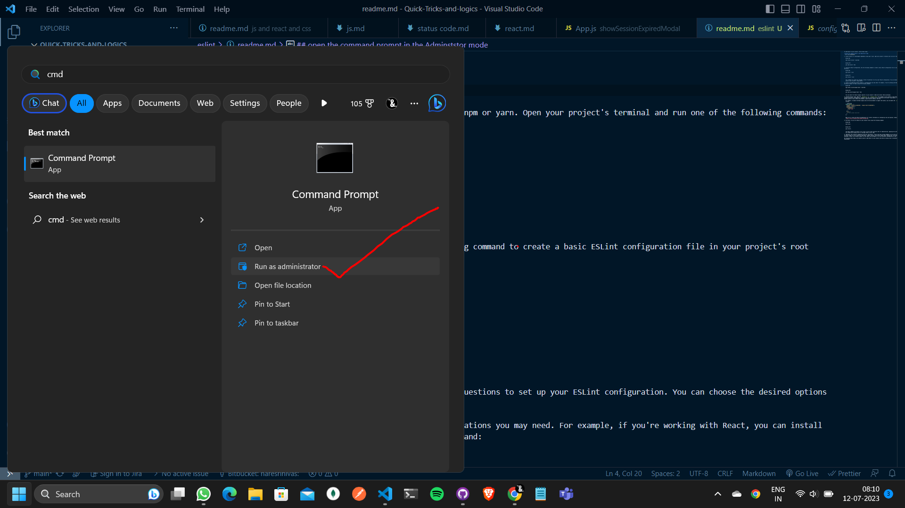
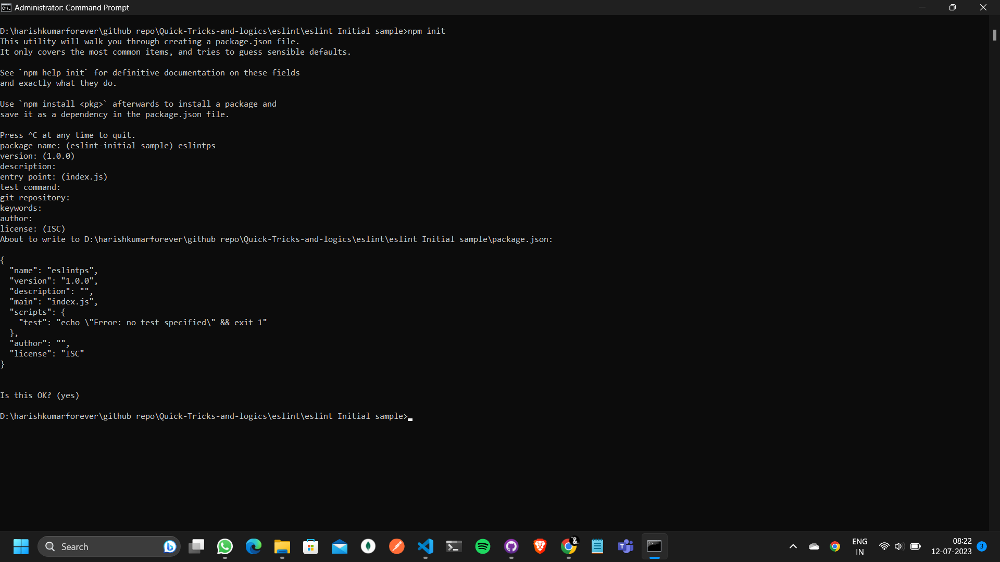
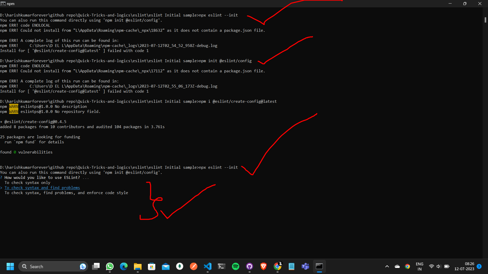
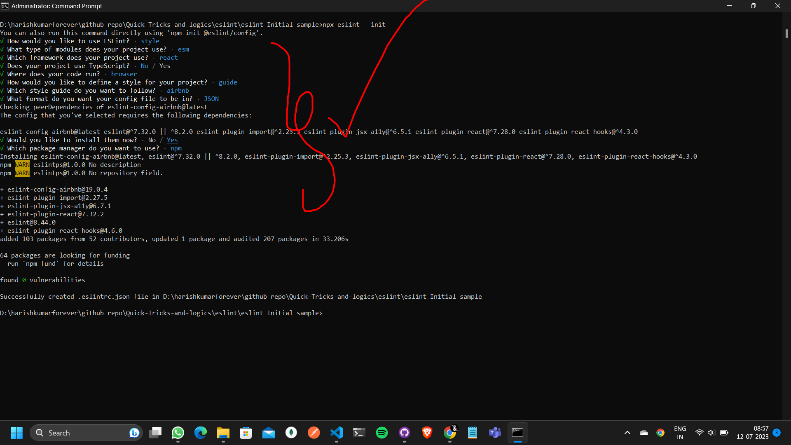
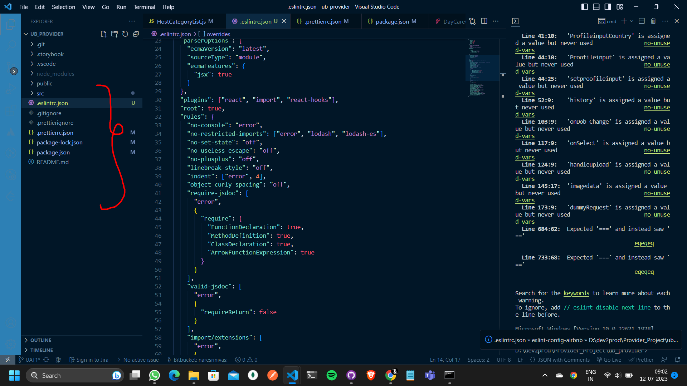
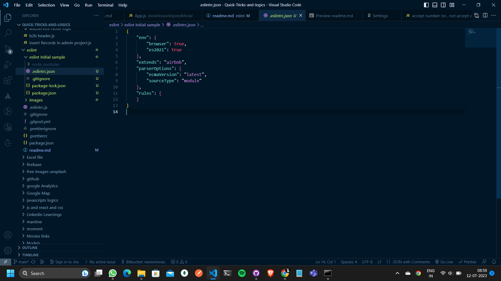
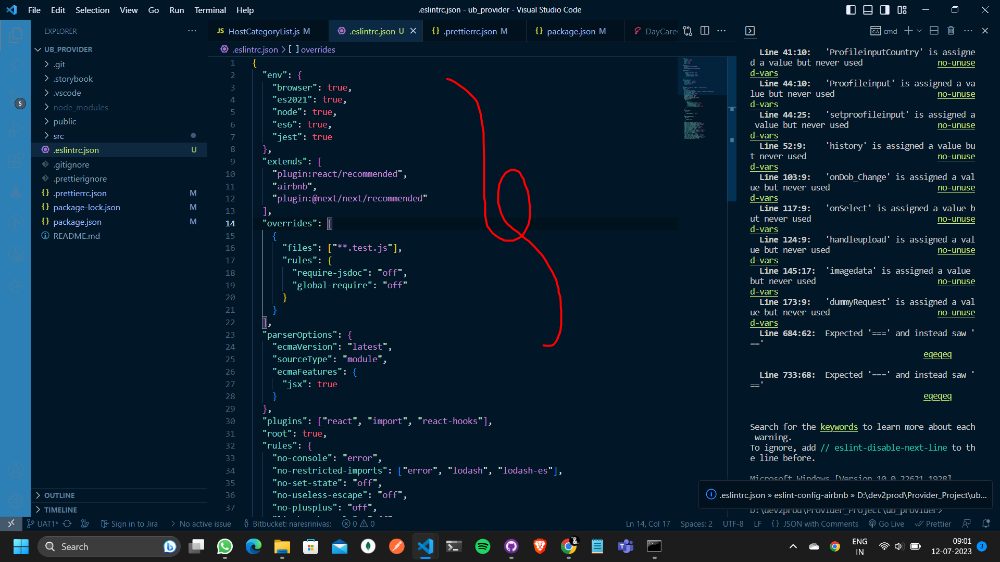

To add ESLint to your project, follow these steps:
 
 ## open the command prompt in the Adminststor mode 
 


# if project dont have package.json then do npm init these will create a package.json file

 

1. Install ESLint as a development dependency using npm or yarn. Open your project's terminal and run one of the following commands:

   Using npm:
   ```
   npm install eslint --save-dev
   ```

   Using yarn:
   ```
   yarn add eslint --dev
   ```

2. Initialize ESLint configuration. Run the following command to create a basic ESLint configuration file in your project's root directory:

   Using npm:
   ```
   npx eslint --init
   ```
<!-- 'npm init @eslint/config'.  '@eslint/create-config@latest'-->
   Using yarn:
   ```
   yarn eslint --init
   ```

   This command will guide you through a series of questions to set up your ESLint configuration. You can choose the desired options based on your project's requirements.


 
 <!--  -->
3. ## then it will ask few command like do u want to establish eslint for typescript or javascript and or coding standard etc...

 

4. Install any additional ESLint plugins or configurations you may need. For example, if you're working with React, you can install the ESLint plugin for React using the following command:

   Using npm:
   ```
   npm install eslint-plugin-react --save-dev
   ```

   Using yarn:
   ```
   yarn add eslint-plugin-react --dev
   ```

   You can search for ESLint plugins specific to your project's needs and install them accordingly.


5. Configure ESLint rules. Open the `.eslintrc.js` or `.eslintrc.json` file created in your project's root directory. This file contains the ESLint configuration. Customize the rules according to your preferences and project requirements. You can enable or disable specific rules, define environments, specify parser options, and more.

   For example, to enable the React plugin and set the environment to support JSX syntax, you can modify the `.eslintrc.js` file as follows:

   ```javascript
   module.exports = {
     extends: ['eslint:recommended', 'plugin:react/recommended'],
     plugins: ['react'],
     parserOptions: {
       ecmaFeatures: {
         jsx: true,
       },
     },
     rules: {
       // Your custom rules here
     },
   };
   ```

   Make sure to review the ESLint documentation for further information on configuring rules and options: [ESLint Configuration](https://eslint.org/docs/user-guide/configuring).
# auto generated files by eslint
 

# auto generated initialeslintconfig files by eslint
 

 
#  custom newslintConfig files by eslint
 

 
6. Run ESLint. You can run ESLint on your project files using the following command:

   Using npm:
   ```
   npx eslint .
   ```

   Using yarn:
   ```
   yarn eslint .
   ```

   The above command runs ESLint on all files in the current directory and its subdirectories, applying the configured rules. ESLint will output any linting errors or warnings found in your code.

7. (Optional) Set up ESLint integration with your code editor. To get real-time linting feedback as you write code, you can install an ESLint plugin for your preferred code editor. Popular editors like Visual Studio Code, Sublime Text, and Atom have ESLint plugins available. Install the relevant plugin for your editor and configure it to use the ESLint configuration in your project.

By following these steps, you should be able to add ESLint to your project and enforce linting rules to maintain code quality and consistency.